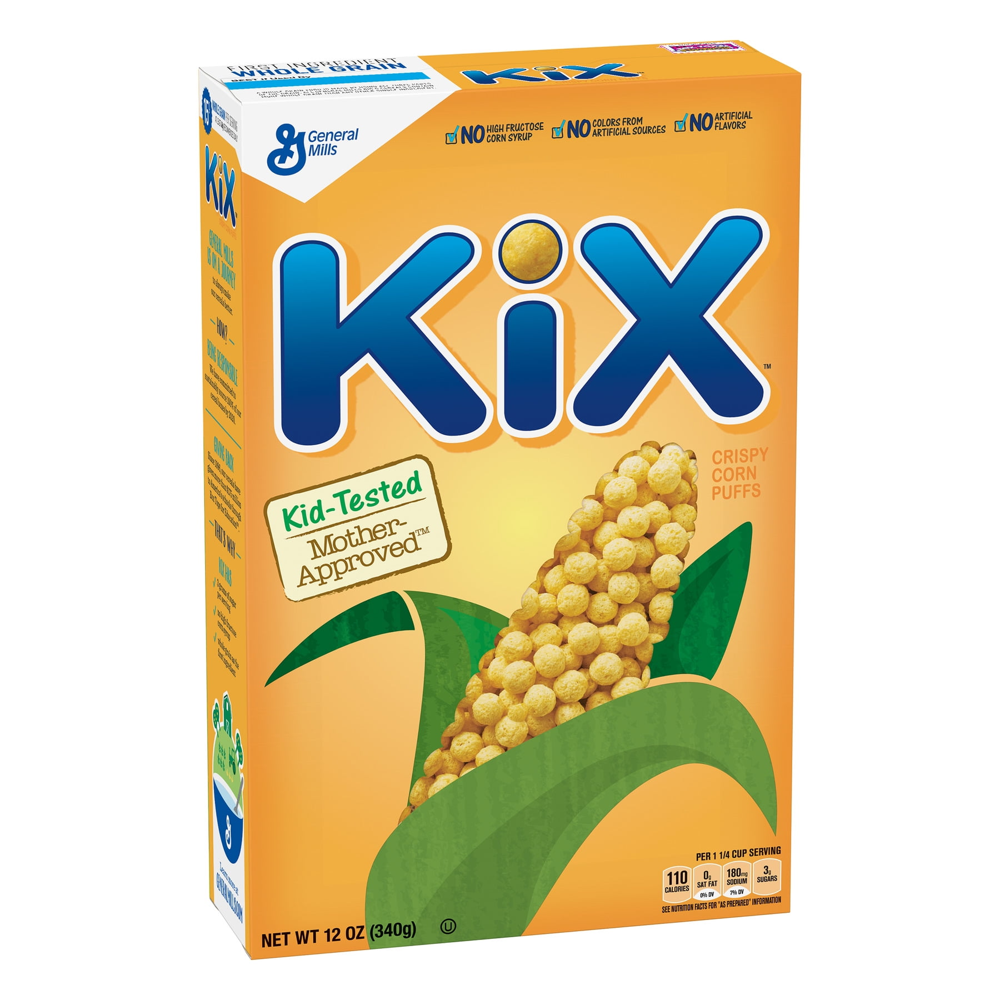

# QYX - Python Code Quality Data Warehouse

> A comprehensive code quality analysis and visualization platform for Python projects

**QYX** (pronounced "kix") is a proof-of-concept data warehouse that aggregates, analyzes, and reports on various code quality metrics for Python projects. It provides both CLI and web interfaces to track code quality over time, including historical git analysis.

## CLI View


## Web View


## Features

- **Multi-Tool Integration**: Aggregate metrics from tools like CLOC, Ruff, Ty, Radon, Scc, and custom analyzers.
- **Persistent Storage**: Built-in database for historical tracking and trend analysis.
- **CLI Interface**: Terminal output with detailed reports at multiple levels.
- **Web Dashboard**: Interactive dashboard.
- **Git Integration**: Analyze code across commit history.
- **Configurable Grading**: Define custom thresholds and scoring for all metrics.
- **Multi-Level Reporting**: Summary, directory, file, granular and historical views.

## Tools & Metrics

### CLOC (Count lines of Code)
- Lines of code, blank lines, comment lines
- Code density percentage
- Comment ratio
- File size distribution

### Ruff (Astral python linting)
- Violation counts per rule and severity
- Violations per KLOC
- Weighted scoring by severity
- Per-file and directory aggregation

### Ty (Astral Type-checker)
- Python type checker

### Radon (Complexity analysis)
Four sub-analyses providing comprehensive complexity metrics:
- **CC** (Cyclomatic Complexity): Function and class complexity
- **MI** (Maintainability Index): Overall maintainability score (0-100)
- **HAL** (Halstead Metrics): Effort, difficulty, bugs prediction
- **RAW** (Raw Metrics): Operators, operands, basic counts

### Scc (Succint Code Counter)
- Lines of code, Unique lines of code, blank lines, comment lines

### FXTD (Custom annotation tracker)
Track code annotations and technical debt markers:
- FIXME, TODO, HACK, BUG, XXX, NOTE markers
- Weighted scoring by severity
- Per-KLOC metrics

### GA (Custom Git Analytics)
Track various git metrics:
- Top Committers/Authors
- Files with the most bug commits
- Files with the most emergency commits
- Files with the most commits (file churn)
- Commit Frequency per month

## Installation

### Prerequisites

- Python >= 3.11.9
- External tools (installed separately):
  - `cloc`  - Count Lines of Code
  - `ruff`  - Python linter
  - `radon` - Complexity analyzer
  - `scc`   - Count Lines of Code
  - `ty`    - Python type checker
  - `git`   - Version control

### Install QYX

#### From PyPI (Usual path)

```bash
uv pip install qyx
```

#### Manually

```bash
git clone <repository-url>
uv sync
uv run qyx --help
```

## Quick Start

If you run `qyx` without arguments, it enters interactive mode with guided prompts:

```bash
uv(x) run qyx
```

```
   ____ __  __ _  __
  / __ \\ \/ /| |/ /
 / / / / \  / |   /
/ /_/ /  / / /   |
\___\_\ /_/ /_/|_|

QYX → Code Quality Analysis Tool
? Command: (Use shortcuts or arrow keys)
 » ● s) Status
   ○ r) Report
   ○ i) Ingest
   ○ v) Serve
   ○ a) Admin
   ────────────
   ○ x) Exit
```

## Direct Command-Line Options

### Ingest Code Quality Metrics

```bash
# Analyze current project (will ingest using all available tools)
qyx ingest --name myproject --path /path/to/project

# Ingest just a specific tool
qyx ingest --name myproject --path /path/to/project --tool ruff

# Read from stdin (pipe tool output)
ruff check --output-format=json . | qyx ingest --name myproject --stdin --tool ruff
```

### View Status

```bash
# Summary status
qyx status
```

### Generate Reports

```bash
# Summary report
qyx report --name myproject

# Directory-level report
qyx report --name myproject --level 1

# File-level report
qyx report --name myproject --level 2

# Detailed metrics
qyx report --name myproject --level 3

# Historical trends with charts
qyx report --name myproject --level h
```

### Web Interface

```bash
# Start web server on default port (5011)
qyx serve

# Custom port and auto-launch browser
qyx serve --port 8080 --browser

# Access at http://localhost:5011
```

### Database Administration

```bash
# Safe housekeeping (remove orphaned records)
qyx admin clean

# Remove old scan data
qyx admin clean

# Delete specific project
qyx admin delete --target project:5
```

## Configuration

QYX uses `config.yaml` for default settings and metric thresholds.

### Configuration File Location

Default: `./config.yaml` in the project root

### Configuration Structure

```yaml
# Tool-specific configurations
tools:
  cloc:
	command:
	  - cloc
	  - --by-file
	  - --include-lang=Python
	  - --vcs=git
	  - --json
	  - "{absolute}"
code_density:
	  thresholds:
		- {min: 10, max: 60, grade: "A", color: "#22c55e"}
		- {min: 60, max: 70, grade: "B", color: "#84cc16"}
		# ... more thresholds

  ruff:
	violation_weights:
	  F: 5.0  # Bugs
	  B: 4.0  # Design
	  S: 4.0  # Security
	  E: 3.0  # Errors
	  # ... more weights

  radon:
	cc:  # Cyclomatic Complexity
	  class_complexity:
		thresholds:
		  - {min: 0, max: 10, grade: "A", color: "#22c55e"}
		  # ... more thresholds

	mi:  # Maintainability Index
	  maintainability_index:
		thresholds:
		  - {min: 85, max: 100, grade: "A", color: "#22c55e"}
		  # ... more thresholds

	hal:  # Halstead Metrics
	  composite:
		thresholds:
		  - {min: 0, max: 50, grade: "A", color: "#22c55e"}
		  # ... more thresholds

  fxtd:
	weights:
	  BUG: 3.0
	  FIXME: 3.0
	  HACK: 3.0
	  TODO: 2.0
	  NOTE: 1.0
```

### Overriding Configuration

CLI arguments override config file settings:

```bash
# Override log level
qyx report --name myproject --log-level DEBUG

# Override project path
qyx ingest --name myproject --path /custom/path
```

## CLI Reference

### Commands

#### `qyx ingest`

Analyze code with quality tools and store results.

```bash
qyx ingest [OPTIONS]
```

**Options:**
- `--name TEXT`: Project name (required)
- `--path PATH`: Project path (required for non-stdin)
- `--tool TEXT`: Specific tool to run (cloc, ruff, radon, fxtd etc.)
- `--stdin TEXT`: Read from stdin for specified tool
- `--log-level LEVEL`: Logging level (DEBUG, INFO, WARNING, ERROR)

#### `qyx report`

Generate code quality reports.

```bash
qyx report [OPTIONS]
```

**Options:**
- `--name TEXT`: Project name (required)
- `--level LEVEL`: Report level (0=summary, 1=directory, 2=file, 3=detail, d=derived, h=history)
- `--log-level LEVEL`: Logging level

#### `qyx status`

Display project analysis status.

```bash
qyx status [OPTIONS]
```

**Options:**
- `--name TEXT`: Project name (optional, shows all if not specified)
- `--level LEVEL`: Status level (g=grouped, i=individual)
- `--log-level LEVEL`: Logging level

#### `qyx serve`

Start web dashboard server.

```bash
qyx serve [OPTIONS]
```

**Options:**
- `--port INT`: Server port (default: 5011)
- `--browser`: Auto-launch browser
- `--log-level LEVEL`: Logging level

#### `qyx admin clean`

Safe database housekeeping (removes orphaned records).

#### `qyx admin delete`

Delete specific project, request or scan from database. Use syntax "project:<id>", "request:<id>" or "scan:<id>" to specify the particular instance to delete.

## Web Interface

The web dashboard provides an interactive view of all metrics.

### Features

- **Project Selection**: Dropdown to switch between analyzed projects
- **Tool Panels**: Dedicated panels for each analysis tool (CLOC, Ruff, Radon, FXTD)
- **Dynamic Updates**: HTMX-powered updates without page reloads
- **Charts**: Historical trend visualization using Plotly
- **Multi-Level Views**: Summary, directory, file, and detail levels
- **Health Monitoring**: `/health` endpoint for status checks

### Routes

- `/` - Home dashboard with all tool panels
- `/<tool>` - Detailed view for specific tool
- `/partials/project-selector` - Dynamic project selection
- `/partials/analysis-selector` - Dynamic analysis selection
- `/static/*` - CSS and static assets
- `/health` - Server health check

## Project Structure

```
python-code-quality/
├── src/qyx/                    # Main package
│   ├── __main__.py             # Entry point
│   ├── constants.py            # Enums and constants
│   ├── cli/                    # CLI interface
│   │   ├── ingest.py           # Method(s) to ingest new data using specific tools
│   │   ├── report.py           # Method(s) to drive interactive reporting
│   │   ├── status.py           # Method(s) to report on database storage.
│   │   └── admin/              # Admin commands
│   ├── setup/                  # Configuration & initialization methods
│   │   └── ...
│   ├── tools/                  # Analysis tool integrations
│   │   ├── common.py
│   │   ├── _models_/           # Base storage classes
│   │   ├── <tool>/
│   │   │   ├── __init__.py     # Tool configuration
│   │   │   ├── models.py       # Tool Peewee storage model & query methods
│   │   │   ├── parse.py        # Tool logic to parse/save inbound scans
│   │   │   ├── cli.py          # CLI interface for reporting (optional)
│   │   │   ├── web.py          # Web interface for reporting (optional)
│   │   │   └── templates/      # Tool specific web interface templates
│   │   └── ...
│   ├── web/                    # Web interface
│   │   ├── ...
│   │   ├── templates/          # Web interface base templates (not tool specific)
│   │   └── static/
│   └── utils/                  # Shared utilities
│       └── ...
├── tests/                      # Test suite
├── config.yaml                 # Configuration
├── pyproject.toml              # Project metadata
└── README.md                   # This file
```

## Grading System

QYX uses a configurable grading system (A-F) with color coding:

- **A** (Green): Excellent
- **B** (Light Green): Good
- **C** (Yellow): Acceptable
- **D** (Orange): Needs Improvement
- **F** (Red): Poor

Each metric has customizable thresholds in `config.yaml`:

```yaml
thresholds:
  - {min: 85, max: 100, grade: "A", color: "#22c55e"}
  - {min: 70, max: 85, grade: "B", color: "#84cc16"}
  - {min: 60, max: 70, grade: "C", color: "#eab308"}
  - {min: 50, max: 60, grade: "D", color: "#f97316"}
  - {min: 0, max: 50, grade: "F", color: "#ef4444"}
```

## Report Levels

QYX provides multiple reporting levels for different perspectives:

|-------|-----------------------------------------------------------|
| Level | Description                                               |
|-------|-----------------------------------------------------------|
| 0     | Project-level single metric                               |
| 1     | Next level, usually directory-level detail                |
| 2     | Next level, usually file-level detail                     |
| 3     | Granual/detailed metrics (function-level where available) |
| h     | Historical trends (with charts in web interface)          |
|-------|-----------------------------------------------------------|

## Examples

### Typical Workflow

```bash
# 1. Initial analysis
qyx ingest --name myproject --path ~/projects/myapp

# 2. Check status
qyx status --name myproject

# 3. View summary report
qyx report --name myproject --level 0

# 4. Drill into files with issues
qyx report --name myproject --level 2

# 5. Start web dashboard for exploration
qyx serve --browser

# 6. After code changes, re-analyze
qyx ingest --name myproject --path ~/projects/myapp

# 7. View historical trends
qyx report --name myproject --level h
```

### Analyzing Git History

```bash
# Analyze all commits in repository
qyx ingest --name myproject --path https://github.org/someone/myproject

# This will:
# 1. Clone the repo and get the complete commit history
# 2. For each commit not yet processed:
# 3. - Will checkout the commit
# 4. - Run analysis tool(s)
# 5. - Store results with commit metadata

# View historical trends
qyx report --name myproject --tool ruff --level h
```

### Custom Analysis Pipeline

```bash
# Run only specific tools
qyx ingest --name myproject --path . --tool ruff
qyx ingest --name myproject --path . --tool radon_cc

# Pipe custom tool output
my-custom-tool --json | qyx ingest --name myproject --stdin ruff
```
## Development

### Running Tests

```bash
# Run all tests
pytest

# Run specific test file
pytest tests/test_smoke_cli.py

# Run with verbose output
pytest -v

# Run with coverage
pytest --cov=qyx
```

### Adding a New Tool

1. Create tool directory in `src/qyx/tools/<tool_name>/`
2. Add requisite/desired configuration to `config.yaml`
3. Implement required modules:
   - `__init__.py` - Tool configuration
   - `models.py` - Database models
   - `parse.py` - Data ingestion logic
2. Implement optional modules:
   - `cli.py` - CLI rendering (if desired)
   - `web.py` + templates - Web rendering (if desired but at least a summary/level 0  rendering is suggested to appear on the primary web dashboard)

### Database Schema

QYX uses Peewee ORM with SQLite3.

**Core Tables:**
- `project` - Project records
- `request` - Analysis requests
- `scan` - Individual tool runs

**Tool-Specific Tables:**

For example:
- `tool_cloc` - Line counting
- `tool_fxtd` - Annotation tracking
- `tool_radon_cc` - Cyclomatic complexity
- `tool_radon_hal_function` - Per-function Halstead
- `tool_radon_hal` - Halstead metrics
- `tool_radon_mi` - Maintainability index
- `tool_radon_raw` - Raw metrics
- `tool_ruff` - Linting violations
- `tool_ty` - Type check results
- ...


## Troubleshooting

### Tool Not Found

The commands used to ingest data from each specific tool are listed in the respective tools section of config.yaml. For example, for the `cloc` tool, here are the commands/options used:

```yaml
tools:
  cloc:
	command:
	  - cloc
	  - --by-file
	  - --include-lang=Python
	  - --vcs=git
	  - --json
	  - "{absolute}"
```

Obviously, each tool must be already on your path (qyx will check each tools ability to run on startup).

To check if tools are available:

```bash
which cloc
which radon
which ruff
# ...
#
# Install missing tools (for example):
#  `uv tool install <tool>`
# or
#  `brew install <tool>`
#
# or use your platform's package manager of choice to get the tool(s) onto your path.
#
# etc.
```

### Permission Issues

On MacOS, database location: `~/Library/Application\ Support/qyx/db.sqlite3`.

On other platforms (albeit not tested) we use the XDG "user-data-directory".

The location can be overridden in the configuration file under `general.database.path`.

Ensure write permissions:

```bash
mkdir  -p ~/Library/Application\ Support/qyx
chmod 755 ~/Library/Application\ Support/qyx
```

## Contributing

This is a proof-of-concept project. Contributions are welcome!

## License

MIT License

## Author

Péter Böröcz

## Acknowledgments

Happily built with:
- [Peewee](http://docs.peewee-orm.com/) - Simple and expressive ORM
- [Rich](https://rich.readthedocs.io/) - Beautiful terminal output
- [Bottle](https://bottlepy.org/docs/dev/index.html) -  WSGI micro web-framework
- [Jinja](https://jinja.palletsprojects.com/en/stable/) - Templating engine
- [HTMX](https://htmx.org/) - Dynamic web interactions
- [Plotly](https://plotly.com/python/) - Elegant charts
- [Claude](https://claude.ai/) - Coding support (<5% of the code base!)

## Version

0.2.0 (POC)
